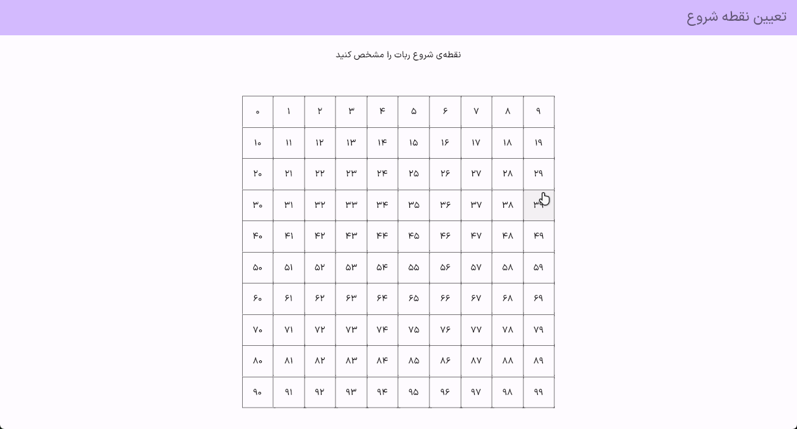

# BSP-Maze-Solver-Robot-Simulator

## Overview

This repository contains the code for a maze-solving robot simulator developed as a subproject for the Principles of Robotics course at Jahrom University under the guidance of Dr. Reza MosallaNezhad. The simulator is implemented in Dart programming language and the Flutter framework. It is designed to simulate a robot's navigation through mazes using online search algorithms, with a specific example utilizing the Depth-First Search (DFS) algorithm.

Wait a bit for the corresponding gif file to be loaded into the software :
<br>


## Features

- Maze Generation: The simulator can generate random mazes of varying complexity.
- Maze Solving: It employs online search algorithms to find a path from the start to the goal in the maze.
- Visualization: The graphical interface provides a real-time visualization of the robot's movement and pathfinding process.
- Responsive Design: The application is responsive and can adapt to different screen sizes.

## Getting Started

Follow these steps to get the project up and running on your local machine:

1. Clone this repository to your local machine:

   ```shell
   git clone https://github.com/your-username/BSP-Maze-Solver-Robot-Simulator.git
   ```

2. Navigate to the project directory:

   ```shell
   cd BSP-Maze-Solver-Robot-Simulator
   ```

3. Ensure you have Dart and Flutter installed. You can download them from [here](https://flutter.dev/docs/get-started/install).

4. Install project dependencies:

   ```shell
   flutter pub get
   ```

5. Run the simulator:

   ```shell
   flutter run
   ```

## Usage

- Use the interface to generate random mazes or load custom ones.
- Select the maze-solving algorithm (e.g., DFS) from the options.
- Start the simulation, and the robot will navigate through the maze.
- Observe the real-time visualization of the robot's pathfinding process.

## Contributing

Contributions to this project are welcome. If you'd like to contribute, please follow these guidelines:

- Fork the repository.
- Create a new branch for your feature or bug fix.
- Make your changes and test them thoroughly.
- Create a pull request explaining your changes.

## Acknowledgments

- Dr. Reza MosallaNezhad and Jahrom University for their guidance and support.
